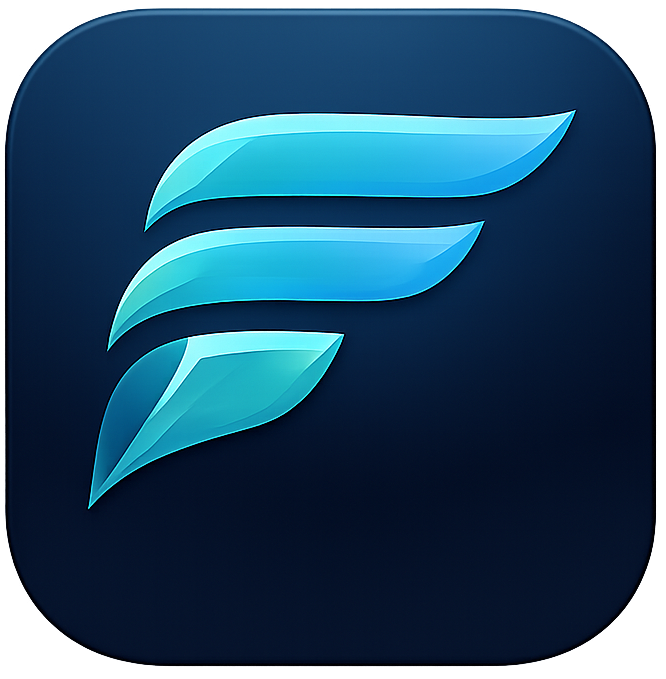

  
  <h1>Fluxion</h1>
  
<b>An AI-Native Learning Platform for Next-Gen Engineering Students</b>

  

    <i>Learning in Motion • Not Just an IDE, but a Personal AI Mentor</i>
  

---

## 🌌 The Philosophy: Repeat. Improve. Grow.
Fluxion isn't built to write your code for you; it's built to teach you how to write yours better. Designed specifically for Computer Engineering students, Fluxion integrates an intelligent, Socratic AI Mentor directly into a desktop IDE. The mentor refuses to spoon-feed answers. Instead, it guides your thought process, asks probing questions, and forces you to understand the underlying concepts while tracking your growth over time.

## ✨ Key Features

- **🧠 Socratic AI Mentor (Assisted Mode)** 
  The AI intentionally avoids giving away direct solutions or writing full code. It acts as a guide, providing directional hints, debugging suggestions, and conceptual clarity to elevate your critical thinking.
- **🔒 Privacy First (Local Models)** 
  Comes integrated with Ollama support out-of-the-box. Run models like Gemma 2b completely offline on your own hardware ensuring zero telemetry and complete privacy.
- **☁️ Cloud Model Support (Gemini API)** 
  Optional lightweight mode powered by Google's Gemini SDK. Students can use their own Free Tier `Gemini API Key` right within the app to leverage powerful cloud models for fast, high-quality responses.
- **👨‍🏫 Professor Dashboard & Analytics** 
  Behind the scenes, Fluxion evaluates problem understanding, debugging approaches, and conceptual clarity, supplying professors with longitudinal profiles of student progression.
- **🌑 Terminal Noir Aesthetic** 
  A meticulously crafted UI/UX that blends rich blue-charcoal tones and pure structure—optimized for deep focus and developer comfort. No gradients, no fluff, just flow.

## 🚀 Installation

Fluxion is currently available as a `.exe` installer for Windows. 

1. Go to the [Releases page](https://github.com/Chirag743/Fluxion-App-Releases/releases/latest).
2. Download the `Fluxion-Setup-1.0.0.exe` file.
3. Run the installer and follow the on-screen instructions.
4. Launch the app and log in! (When signing up, you will need to provide your Gemini API key from [Google AI Studio](https://aistudio.google.com/app/apikey) if you plan to use cloud inference).

## 🛠️ Architecture: How It Works

1. **Write Code**: Write and test your code within the lit-workspace editor.
2. **Ask the Mentor**: Stuck? Invoke the AI Mentor. It captures your code snapshot and recent terminal output automatically to provide contextual hints.
3. **Track Growth**: Behind the scenes, the mentor analyzes your interaction, measures your independence, and maps out the concepts you struggled with vs. mastered.

## 💻 System Capabilities & Tech Stack

- **Frontend/Desktop View**: React, TypeScript, Tailwind CSS, Shadcn UI
- **Wrapper**: Electron (for process management & filesystem access)
- **Local AI execution**: Ollama Integration
- **Cloud Backend**: Node.js, Express, MongoDB (for session synchronization & professor analytics)

## 📌 Usage Guidelines

- **For Students**: When you encounter a bug, do not just copy-paste "fix this". Explain what part of the error confuses you. The mentor's design rewards engagement.
- **API Keys**: We use AES-256-GCM to securely encrypt your Gemini API Key in our backend. Your data is safe.

## 🎓 Credit 

Built with passion and deep thought by **Chirag Parikh**.

---
*If you encounter any issues or want to submit feature requests, please open an Issue on this repository.*
